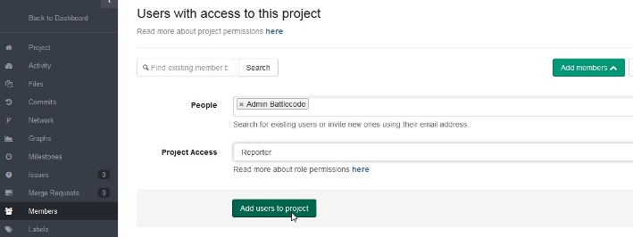
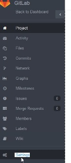
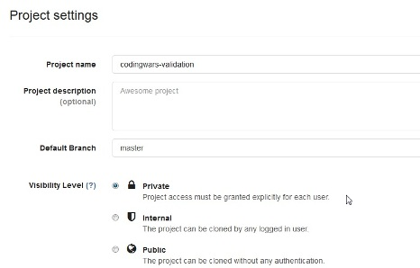

# CODING WARS - Technical Instructions

## Prérequis techniques
* Git
* Maven 3.x
* Jdk 7+
* Your favorite IDE
** Pour ceux qui n'ont pas d'IDE sur leur poste (PO, qualif, étude, catalogue), l'installation rapide à partir du bundle Soft est détaillée sur le wiki : http://dvdsi400w.creteil.francetelecom.fr/wiki/?p=3222
** Pour ceux qui utilise Eclipse, l'installation du plugin cucumber depuis le MarketPlace est recommandée (Natural 0.7.6)

## Getting Started

* Créer votre team sous Gitlab :
http://dvdsi320w.creteil.francetelecom.fr:8888/explore/projects/starred
* Forker le projet template
http://dvdsi320w.creteil.francetelecom.fr:8888/battlecode-admin/codingwars

* Rajouter le compte battlecode-admin en tant que "reporter" de votre projet (dans "Member")

* Penser à modifier la visiblité de votre projet v(dans "Settings")

* Cloner votre projet en local

## Prérequis de développement

* Pas de constructeur avec paramètes dans votre implémentation de PiloteAutomatique
* Aucune méthode ne doit retourner 'null'
* Les secteurs traversés ou interrogés via le sonar ne peuvent pas avoir de cordonnées négatives
